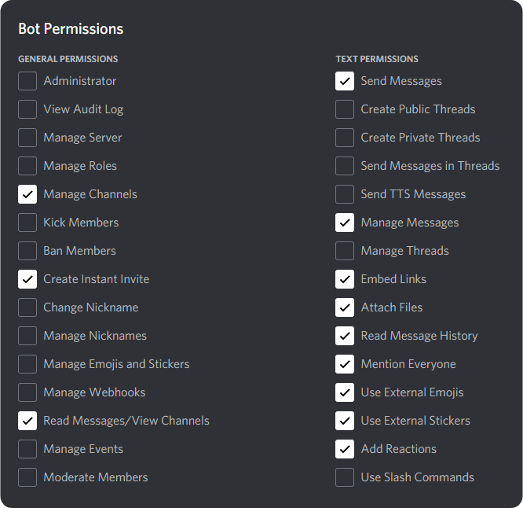

<div id="top"></div>
<!--
*** Thanks for checking out the Best-README-Template. If you have a suggestion
*** that would make this better, please fork the repo and create a pull request
*** or simply open an issue with the tag "enhancement".
*** Don't forget to give the project a star!
*** Thanks again! Now go create something AMAZING! :D
-->


<!-- PROJECT SHIELDS -->
<!--
*** I'm using markdown "reference style" links for readability.
*** Reference links are enclosed in brackets [ ] instead of parentheses ( ).
*** See the bottom of this document for the declaration of the reference variables
*** for contributors-url, forks-url, etc. This is an optional, concise syntax you may use.
*** https://www.markdownguide.org/basic-syntax/#reference-style-links
-->


<!-- PROJECT LOGO -->
<br />
<div align="center">
  <a href="https://github.com/SuperrMurlocc/InformatykaBocik">
    
  </a>

<h3 align="center">Inf WEEIA Discord Bot</h3>

  <p align="center">
    <a href="https://github.com/SuperrMurlocc/InformatykaBocik"><strong>Explore the docs »</strong></a>
    <br />
    <br />
    <a href="https://github.com/SuperrMurlocc/InformatykaBocik">View Demo</a>
    ·
    <a href="https://github.com/SuperrMurlocc/InformatykaBocik/issues">Report Bug</a>
    ·
    <a href="https://github.com/SuperrMurlocc/InformatykaBocik/issues">Request Feature</a>
  </p>
</div>


<!-- TABLE OF CONTENTS -->
<details>
  <summary>Table of Contents</summary>
  <ol>
    <li>
      <a href="#about-the-project">About The Project</a>
      <ul>
        <li><a href="#built-with">Built With</a></li>
      </ul>
    </li>
    <li>
      <a href="#getting-started">Getting Started</a>
      <ul>
        <li><a href="#prerequisites">Prerequisites</a></li>
        <li><a href="#installation">Installation</a></li>
      </ul>
    </li>
    <li><a href="#usage">Usage</a></li>
    <li><a href="#roadmap">Roadmap</a></li>
    <li><a href="#contributing">Contributing</a></li>
    <li><a href="#license">License</a></li>
    <li><a href="#contact">Contact</a></li>
    <li><a href="#acknowledgments">Acknowledgments</a></li>
  </ol>
</details>


<!-- ABOUT THE PROJECT -->
## O projekcie


katalogi

- **src**:
	- **keep_alive.py** do podtrzymywania repla,
	- **checks.py** w który będziemy wrzucać ograniczenia komend (np tylko dla administratorów itd)
	- **secrets.py** czyli banalna obsługa sekretów

- **cogs**:
	- każdy cog jest „modułem” czyli zestawem komend
	- Każdy moduł można ładować i wyładować (patrz sekcja moduły w main)

- **dev**:
	- Tam można tez wrzucać jakieś komendy tylko dla nas (devów)
	- jest komenda ping, taka do sprawdzenia czy bot stoi i jaki ma ping.

**polls.py** - pierwsze szkice ankiety na tak/nie oraz wielo opcjonalnej


### Ankiety

tak / nie - użycie
```
$ynpoll Przykładowe pytanie?
```
wiele odp. - użycie
```
$mopoll co lubicie bardziej? & krewetki | banany & 1
```

Oczywiście dolarek przykładowy, do zmiany w mainie


<p align="right">(<a href="#top">back to top</a>)</p>


<!-- ROADMAP -->
## Sugestie lub rzeczy do poprawki (priorytet malejący)

- [ ] Ankiety:
	- [ ] Maksymalna liczba odpowiedzi w ankiecie
	- [ ] Słupki postępu

- [ ] Dokumentacja czyli jak się danej komendy używa
- [ ] Losowanie użytkownika w obrębie danej roli (np. $random Filmowiec)
- [ ] Uzupełnienie .env o dane serwera Inf WEEIA
- [ ] Komenda do przesyłania sugestii
- [ ] Komendy w języku polskim? Chyba byłoby łatwiej zapamiętać (lub może wybór języka)

See the [open issues](https://github.com/SuperrMurlocc/InformatykaBocik/issues) for a full list of proposed features (and known issues).

<p align="right">(<a href="#top">back to top</a>)</p>


<!-- GETTING STARTED -->
## Lokalna instancja Bota

Ten Bot został zaprojektowany z myślą o prostym dodawaniu funkcjonalności przez użytkowników. Jeśli chcesz uruchonić go na swojej maszynie, postępuj zgodnie z poniższą instrukcją.

### Instalacja

Na początek upewnij się, że posiadasz wszystkie wymagane do działania bota narzędzia.
* [`Python`](https://www.python.org/downloads/) w wersji 3.8 lub wyższej oraz poniższe biblioteki:
  ```sh
  python --version
  ```

	* Instalator pakietów [`pip`](https://www.odoo.com/forum/help-1/how-to-install-pip-in-python-3-on-ubuntu-18-04-167715)
	```sh
	pip3 --version
	```

* `discord.py` - API Discorda
	```sh
	pip install discord.py
	```

* `dotenv`
	```sh
	pip install dotenv
	```

### Tworzenie klucza API

1. Stwórz nową aplikację [https://discord.com/developers/applications/](https://discord.com/developers/applications/)

2. Przejdź do zakładki **Bot** &rarr; **Add bot** &rarr; **Yes, do it!**

3. Wygeneruj **Token** oraz zapisz go w bezpiecznym miejscu

4. Przejdź do zakładki **OAuth2** &rarr; **URL Generator** oraz zaznacz opcję **bot**

5. Zaznacz odpowiednie permisje


6. Skopiuj **Invite Link**

7. Wróć do zakładki **Bot** a następnie zaznacz opcje w **Privileged Gateway Intents** (PRESENCE INTENT, SERVER MEMBERS INTENT oraz MESSAGE CONTENT INTENT) ✅

8. Zaproś bota na swój serwer za pomocą **Invite Link**


<p align="right">(<a href="#top">back to top</a>)</p>


### Built With

* [Python](https://www.python.org/)
* [Discord.py](https://discordpy.readthedocs.io/en/stable/index.html)
* [replit.com](https://replit.com/~)

<p align="right">(<a href="#top">back to top</a>)</p>


<!-- USAGE EXAMPLES -->
## Usage

Use this space to show useful examples of how a project can be used. Additional screenshots, code examples and demos work well in this space. You may also link to more resources.

_For more examples, please refer to the [Documentation](https://example.com)_

<p align="right">(<a href="#top">back to top</a>)</p>


<!-- CONTRIBUTING -->
## Contributing

Contributions are what make the open source community such an amazing place to learn, inspire, and create. Any contributions you make are **greatly appreciated**.

If you have a suggestion that would make this better, please fork the repo and create a pull request. You can also simply open an issue with the tag "enhancement".
Don't forget to give the project a star! Thanks again!

1. Fork the Project
2. Create your Feature Branch (`git checkout -b feature/AmazingFeature`)
3. Commit your Changes (`git commit -m 'Add some AmazingFeature'`)
4. Push to the Branch (`git push origin feature/AmazingFeature`)
5. Open a Pull Request

<p align="right">(<a href="#top">back to top</a>)</p>


<!-- LICENSE -->
## License

Distributed under the (...). license See `LICENSE.txt` for more information.

<p align="right">(<a href="#top">back to top</a>)</p>


<!-- CONTACT -->
## Contact

Your Name - email@email_client.com

Project Link: [https://github.com/SuperrMurlocc/InformatykaBocik](https://github.com/SuperrMurlocc/InformatykaBocik)

<p align="right">(<a href="#top">back to top</a>)</p>


<!-- ACKNOWLEDGMENTS -->
## Acknowledgments

* [.README Template](https://github.com/othneildrew/Best-README-Template)

<p align="right">(<a href="#top">back to top</a>)</p>


<!-- MARKDOWN LINKS & IMAGES -->
<!-- https://www.markdownguide.org/basic-syntax/#reference-style-links -->
[contributors-shield]: https://img.shields.io/github/contributors/SuperrMurlocc/InformatykaBocik.svg?style=for-the-badge
[contributors-url]: https://github.com/SuperrMurlocc/InformatykaBocik/graphs/contributors
[forks-shield]: https://img.shields.io/github/forks/SuperrMurlocc/InformatykaBocik.svg?style=for-the-badge
[forks-url]: https://github.com/SuperrMurlocc/InformatykaBocik/network/members
[stars-shield]: https://img.shields.io/github/stars/SuperrMurlocc/InformatykaBocik.svg?style=for-the-badge
[stars-url]: https://github.com/SuperrMurlocc/InformatykaBocik/stargazers
[issues-shield]: https://img.shields.io/github/issues/SuperrMurlocc/InformatykaBocik.svg?style=for-the-badge
[issues-url]: https://github.com/SuperrMurlocc/InformatykaBocik/issues
[license-shield]: https://img.shields.io/github/license/SuperrMurlocc/InformatykaBocik.svg?style=for-the-badge
[license-url]: https://github.com/SuperrMurlocc/InformatykaBocik/blob/master/LICENSE.txt
[linkedin-shield]: https://img.shields.io/badge/-LinkedIn-black.svg?style=for-the-badge&logo=linkedin&colorB=555
[linkedin-url]: https://linkedin.com/in/linkedin_username
[product-screenshot]: img/screenshot.png

[![Product Name Screen Shot][product-screenshot]](https://example.com)