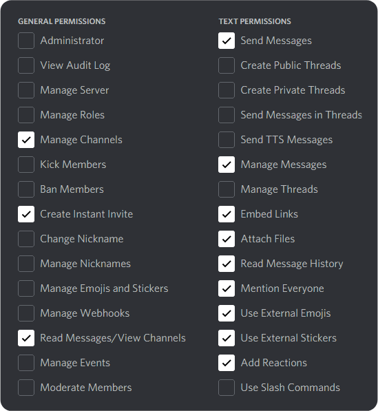

<div id="top"></div>
<!--
*** Thanks for checking out the Best-README-Template. If you have a suggestion
*** that would make this better, please fork the repo and create a pull request
*** or simply open an issue with the tag "enhancement".
*** Don't forget to give the project a star!
*** Thanks again! Now go create something AMAZING! :D
-->


<!-- PROJECT SHIELDS -->
<!--
*** I'm using markdown "reference style" links for readability.
*** Reference links are enclosed in brackets [ ] instead of parentheses ( ).
*** See the bottom of this document for the declaration of the reference variables
*** for contributors-url, forks-url, etc. This is an optional, concise syntax you may use.
*** https://www.markdownguide.org/basic-syntax/#reference-style-links
-->


<!-- PROJECT LOGO -->
<br />
<div align="center">
  <a href="https://github.com/SuperrMurlocc/InformatykaBocik">
    
  </a>

<h3 align="center">Inf WEEIA Discord Bot</h3>

  <p align="center">
    <a href="https://github.com/SuperrMurlocc/InformatykaBocik/issues">Zgłoś błąd</a>
    ·
    <a href="https://github.com/SuperrMurlocc/InformatykaBocik/issues">Zaproponuj feature</a>
  </p>
</div>


<!-- TABLE OF CONTENTS -->
<details>
  <summary>Spis treści</summary>
  <ol>
    <li>
      <a href="#o-projekcie">O projekcie</a>
      <ul>
        <li><a href="#zbudowane-przy-pomocy">Zbudowane przy pomocy</a></li>
      </ul>
    </li>
    <li>
      <a href="#lokalna-instancja">Lokalna instancja</a>
      <ul>
        <li><a href="#instalacja">Instalacja</a></li>
        <li><a href="#tworzenie-klucza-api">Tworzenie klucza api</a></li>
        <li><a href="#uruchomienie-bota">Uruchomienie bota</a></li>
      </ul>
    </li>
    <li><a href="#komendy">Komendy</a></li>
      <ul>
        <li><a href="#ankiety">Ankiety</a></li>
      </ul>
    <li><a href="#sugestie">Sugestie</a></li>
    <li><a href="#kontrybucja">Kontrybucja</a></li>
    <li><a href="#kontakt">Kontakt</a></li>
    <li><a href="#uznania">Uznania</a></li>
  </ol>
</details>


<!-- O PROJEKCIE -->
## O projekcie


Katalogi:

- **./res/**:
    - zasoby
- **<span style="color:IndianRed">./src/</span>**
    - **cogs**:
    	> Każdy **cog** jest „modułem” czyli **zestawem komend**  
	Każdy moduł można ładować i wyładować (patrz sekcja moduły w main);
		- **dev.py**:
		    - Komendy pomocnicze dla developerów.
		- **polls.py**:
		    - Moduł odpowiedzialny za tworzenie ankiet.
		- **info.py**:
		    - Podaje najważniejsze info o bocie
    - **helpers**:
    	> Pliki pomocnicze 
		- **keep_alive.py** do podtrzymywania repla;
		- **checks.py** ograniczenia komend (np tylko dla administratorów itd);
		- **reactions.py** obsługa reakcji;
		- **secrets.py** czyli banalna obsługa sekretów;
		- **logger.py** jeśli bot działa w trybie `LOGGING_MODE`, to moduł tworzy plik logów w katalogu `log/` zawierający otrzymane webhooki.
- **<span style="color:RoyalBlue">./templates/</span>**
    - templatki pomocnicze

<br>


### Zbudowane przy pomocy

* [Python 3](https://www.python.org/)
* [Discord.py](https://discordpy.readthedocs.io/en/stable/index.html)
* [replit.com](https://replit.com/~)

<p align="right">(<a href="#top">powrót na górę</a>)</p>

<!-- LOKALNA INSTALACJA -->
## Lokalna instancja

Ten Bot został zaprojektowany z myślą o prostym dodawaniu funkcjonalności przez użytkowników. Jeśli chcesz uruchonić go na swojej maszynie, postępuj zgodnie z poniższą instrukcją.

### Instalacja

Na początek upewnij się, że posiadasz wszystkie wymagane do działania bota narzędzia.
* [`Python`](https://www.python.org/downloads/) w wersji 3.8 lub wyższej oraz poniższe biblioteki:
    ```sh
    python3 --version
    ```

	* Instalator pakietów [`pip`](https://www.odoo.com/forum/help-1/how-to-install-pip-in-python-3-on-ubuntu-18-04-167715)

	```sh
	pip3 --version
	```

	* `discord.py` - API Discorda

		```sh
		pip3 install discord.py
		```

	* `dotenv`

		```sh
		pip3 install python-dotenv
		```

### **Tworzenie klucza API**

1. Stwórz nową aplikację [https://discord.com/developers/applications/](https://discord.com/developers/applications/)

2. Przejdź do zakładki **Bot** &rarr; **Add bot** &rarr; **Yes, do it!**

3. Wygeneruj **Token** oraz zapisz go w bezpiecznym miejscu

4. Przejdź do zakładki **OAuth2** &rarr; **URL Generator** oraz zaznacz opcję **bot**

5. Zaznacz odpowiednie permisje 

<div align="center">
	</img>
	<br><br>
</div>
6. Skopiuj **Invite Link**

7. Wróć do zakładki **Bot** a następnie zaznacz opcje w **Privileged Gateway Intents** (PRESENCE INTENT, SERVER MEMBERS INTENT oraz MESSAGE CONTENT INTENT) ✅

8. Zaproś bota na swój serwer za pomocą **Invite Link**

### **Uruchomienie bota**

- Sklonuj to repozytorium za pomocą komendy

	```sh
	git clone https://github.com/SuperrMurlocc/InformatykaBocik
	```

- Stwórz plik `.env` i umieść w nim
	> **UWAGA**: Zrób to tylko jeśli odpalasz Bota lokalnie. Jeśli wykorzystujesz hosting, np. replit, umieść swój **Token** w zakładce **Secrets** pod nazwą `DISCORD_TOKEN`
	
	```
	# .env
	DISCORD_TOKEN = "twój.token.Discord"
	```
	gdzie `twój.token.Discord` to **Token** utworzony w poprzednim kroku


- Uruchom bota za pomocą

	```sh
	python3 main.py
	```
	
	&rarr; Gotowe 🎉


<p align="right">(<a href="#top">powrót na górę</a>)</p>


<!-- KOMENDY -->
## Komendy

### **Ankiety**

tak / nie 
```
$ynpoll Przykładowe pytanie?
```
wiele odp.
```
$mopoll co lubicie bardziej? & krewetki | banany & 1
```

<p align="right">(<a href="#top">powrót na górę</a>)</p>


<!-- SUGESTIE -->
## Sugestie

- [ ] Ankiety:
	- [ ] Implementacja maksymalnej liczby odpowiedzi w ankiecie
	- [ ] Dynamiczne słupki postępu
- [ ] Dokumentacja czyli na `$help {komenda}` jak się danej komendy używa
- [ ] Losowanie użytkownika w obrębie danej roli (np. $random Filmowiec)
- [ ] Komenda do przesyłania sugestii
- [ ] Aliasy do komend w języku polskim
- [ ] Podpięcie Bota do serwera INF WEEIA

<p align="right">(<a href="#top">powrót na górę</a>)</p>


<!-- KONTRYBUCJA -->
## Kontrybucja

Jeśli masz jakieś sugestie, które jesteś w stanie sam zaimplementować, zforkuj to repozytorium i stwórz pull requesta.
Zadbaj proszę o czysty kod, korzystaj z gotowych templatów w katalogu **templates** oraz zachowaj już istniejący styl.

1. Zforkuj projekt
2. Stwórz branch dla swojego feature'a (`git checkout -b feature/AmazingFeature`)
3. Zcommituj swoje zmiany (`git commit -m 'Add some AmazingFeature'`)
4. Dokonaj pusha (`git push origin feature/AmazingFeature`)
5. Otwórz pull request

<p align="right">(<a href="#top">powrót na górę</a>)</p>


<!-- KONTAKT -->
## Kontakt

W razie pytań piszcie do twórców, znajdziecie ich w zakładce Contributors. A w przypadku sugestii i błędów zapraszamy do otwarcia **Issue**.
Link do projektu: [https://github.com/SuperrMurlocc/InformatykaBocik](https://github.com/SuperrMurlocc/InformatykaBocik)

<p align="right">(<a href="#top">powrót na górę</a>)</p>


<!-- UZNANIA -->
## Uznania

* [.README Template](https://github.com/othneildrew/Best-README-Template)

<p align="right">(<a href="#top">powrót na górę</a>)</p>


<!-- MARKDOWN LINKS & IMAGES -->
<!-- https://www.markdownguide.org/basic-syntax/#reference-style-links -->
[contributors-shield]: https://img.shields.io/github/contributors/SuperrMurlocc/InformatykaBocik.svg?style=for-the-badge
[contributors-url]: https://github.com/SuperrMurlocc/InformatykaBocik/graphs/contributors
[forks-shield]: https://img.shields.io/github/forks/SuperrMurlocc/InformatykaBocik.svg?style=for-the-badge
[forks-url]: https://github.com/SuperrMurlocc/InformatykaBocik/network/members
[stars-shield]: https://img.shields.io/github/stars/SuperrMurlocc/InformatykaBocik.svg?style=for-the-badge
[stars-url]: https://github.com/SuperrMurlocc/InformatykaBocik/stargazers
[issues-shield]: https://img.shields.io/github/issues/SuperrMurlocc/InformatykaBocik.svg?style=for-the-badge
[issues-url]: https://github.com/SuperrMurlocc/InformatykaBocik/issues
[product-screenshot]: res/img/screenshot.png
